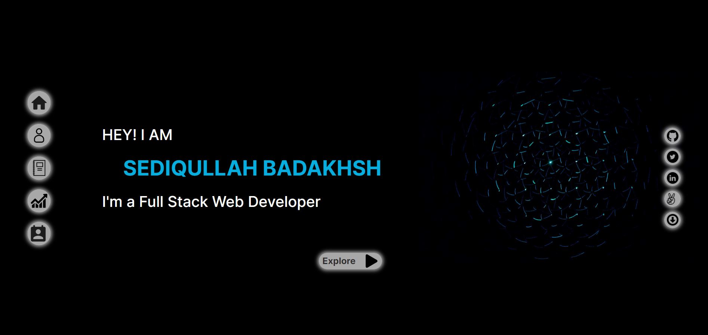

# Badakhsh Portfolio

> My Portfolio webpage
> 
> This is my portfolio Web page, where you can find more about me, my activities, my profile, about my works and if you wish contact me, I created the design prototype in Figma and then started Developing the app after.
> Portfolio Template is free for anyone who wishes to use, but please give me the credits, thanks and appreciate it.
> Note: this webpage is not responsive and it's not recommended for tablets, and mobile devices, responsive design is still under process

## Built With

- HTML
- CSS (SCSS)
- JavaScript
- React

## Live Demo

- [Badakhsh-Portfolio](https://badakhsh-portfolio.netlify.app//).

## Figma Design

- [Portfolio-Template](https://www.figma.com/file/pkg4FJX08YZXWVlrJElNyS/Portfolio-Design)

## Authors

👤 **Sediqullah Badakhsh**

- GitHub: [@sediqullahbadakhsh](https://github.com/sediqullahbadakhsh)
- Twitter: [@sediqullah6](https://twitter.com/sediqullah6)
- LinkedIn: [@sediqullah](https://linkedin.com/in/sediqullah)

## 🤝 Contributing

Contributions, issues, and feature requests are welcome!

## Show your support

Give a ⭐️ if you like this project!

## Credits

Thank you [Unsplash](https://unsplash.com) for the outstanding images and [freeicons.io](https://freeicons.io) for beautiful SVG's
