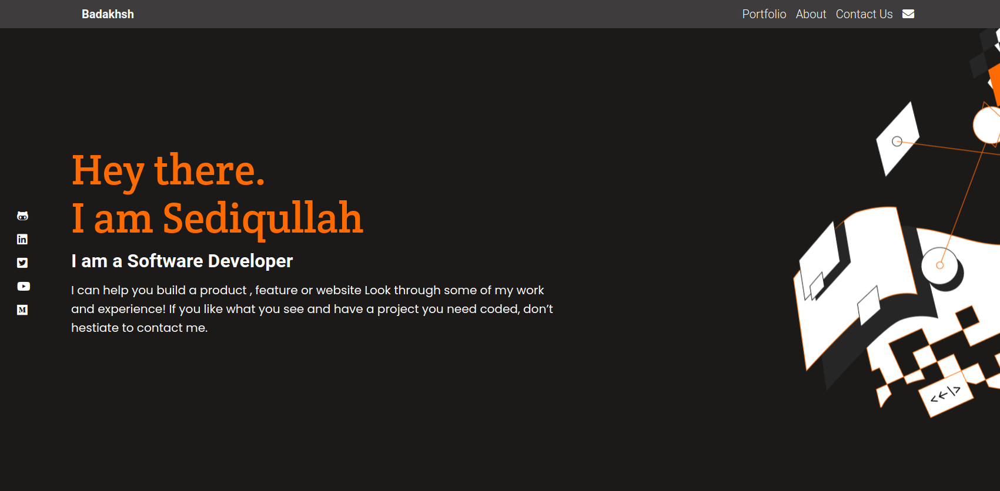

# Badakhsh Portfolio

> My Portfolio webpage
> 

I built this project with HTML, CSS, Javascript and React, a webpage that showcase and shows all information about me.

## Built With

- HTML
- CSS
- JavaScript
- React

## Live Demo

- [Badakhsh-Portfolio](https://badakhsh-portfolio.netlify.app//).

## Authors

👤 **Sediqullah Badakhsh**

- GitHub: [@sediqullahbadakhsh](https://github.com/sediqullahbadakhsh)
- Twitter: [@sediqullah6](https://twitter.com/sediqullah6)
- LinkedIn: [@sediqullah](https://linkedin.com/in/sediqullah)

## 🤝 Contributing

Contributions, issues, and feature requests are welcome!

## Show your support

Give a ⭐️ if you like this project!
